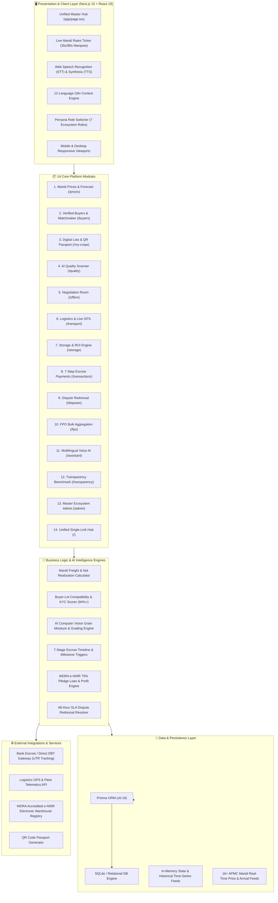
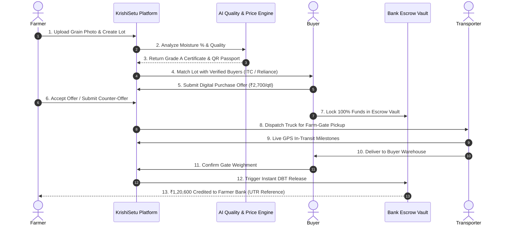

# 🌾 KrishiSetu (कृषिसेतु)
### Multilingual Farmer Market Intelligence, AI Quality Grading & Direct Buyer Ecosystem

[](https://nextjs.org/)
[](https://www.typescriptlang.org/)
[](https://tailwindcss.com/)
[](https://www.prisma.io/)
[](https://vercel.com/)
[](https://github.com/yatikjain318-dot/krishisetu)

---

## 📖 Overview

**KrishiSetu (कृषिसेतु)** is an end-to-end digital agricultural marketplace and market intelligence platform designed to empower smallholder farmers, Farmer Producer Organizations (FPOs), verified institutional corporate buyers (ITC, Reliance Retail, Adani Wilmar, Nestlé), assayers, warehouse operators, and logistics providers.

By eliminating information asymmetry and middleman deductions, KrishiSetu delivers an average **+11.4% higher net realization in farmers' pockets** through real-time APMC mandi feeds, 7-day AI price forecasting, digital grain quality scanning, transparent freight calculators, and 24-hour escrow-backed direct-to-bank settlements.

---

## 🏗️ System Architecture



---

## 🔄 End-to-End Escrow & Trade Flow



---

## 🌟 Key Platform Capabilities (14 Core Modules)

| # | Module | Route | Key Features & Value Proposition |
|---|---|---|---|
| **1** | **Live Mandi Ticker & Comparison Tool** | `/prices` | Stock-market style 35s/90s auto-scrolling ticker with play/pause controls. Live modal rates across 16+ national APMC mandis, arrival volumes, side-by-side freight deduction comparison, and 7-day AI price projections. |
| **2** | **Verified Institutional Buyers & Matchmaker** | `/buyers` | 100% KYC-verified buyers (ITC Agri Business, Reliance Fresh, Adani Wilmar, Nestlé India, Patanjali). 94%+ automated lot matching algorithm based on location, crop grade, and volume. |
| **3** | **Digital Lots & Printable QR Passports** | `/my-crops` | Instant digital lot generation with unique IDs (e.g. `LOT-WHT-2026-8912`). Printable QR code passports containing origin, farmer credentials, moisture %, and assay grade. |
| **4** | **AI Grain Quality Scanner** | `/quality` | 10-second computer-vision grain analyzer measuring moisture %, foreign matter %, broken grain %, and color consistency with Grade A certification and expert advisory. |
| **5** | **Digital Offers & Negotiation Room** | `/offers` | Real-time negotiation room for buyer proposals, instant counter-offers, time-stamped message trail, and 1-click conversion into legally binding escrow orders. |
| **6** | **Agri Logistics & Live GPS Tracking** | `/transport` | Farm-gate fleet booking with transparent ₹/km rates and real-time 5-stage shipment milestone tracking (e.g. `TRK-2026-9041`). |
| **7** | **Scientific Warehousing & ROI Engine** | `/storage` | WDRA-accredited warehouse discovery, 75% e-NWR pledge loan advances at 7% p.a., and interactive *"Sell Now vs Store Later"* profit calculator. |
| **8** | **Transparent 7-Step Escrow Payments** | `/transactions` | Immutable 7-stage settlement timeline from order placement to Bank UTR confirmation (`YESB000284918239`) with downloadable PDF tax invoices. |
| **9** | **Dispute & Grievance Redressal** | `/disputes` | Fast-track redressal system with 48-hour SLA resolution for quality mismatches, weight disputes, and transport delays. |
| **10** | **FPO Bulk Aggregation Portal** | `/fpo` | Tool for FPOs to aggregate harvests from 100+ smallholders into 250-tonne bulk commercial lots for corporate procurement tenders (+₹260/qtl extra profit). |
| **11** | **Multilingual AI Voice Assistant** | `/assistant` | Native voice query engine with speech-to-text (STT) and text-to-speech (TTS) audio playback in 12 Indian regional languages. |
| **12** | **Public Price Transparency Ledger** | `/transparency` | Open benchmark audit ledger displaying Mandi reference prices vs KrishiSetu realized prices (+11.4% extra gain). |
| **13** | **Master Ecosystem Admin Console** | `/admin` | Real-time ecosystem dashboard for KYC moderation, dispute triage, mandi feed sync, and volume analytics. |
| **14** | **Unified Single-Link Master Hub** | `/` | All 14 platform modules interactively integrated and switchable on a single unified URL. |

---

## 🌐 12 Supported Indian Regional Languages

KrishiSetu offers instantaneous, zero-latency 1-click language switching across the entire UI and voice recognition engine:

1. 🌐 **English** (Default Business Language)
2. 🇮🇳 **Hindi (हिन्दी)**
3. 🐪 **Rajasthani (राजस्थानी)**
4. 🌾 **Punjabi (ਪੰਜਾਬੀ)**
5. 🦁 **Gujarati (ગુજરાતી)**
6. 🚩 **Marathi (मराठी)**
7. 🐅 **Bengali (বাংলা)**
8. 🌱 **Telugu (తెలుగు)**
9. 🛕 **Tamil (தமிழ்)**
10. 🐘 **Kannada (ಕನ್ನಡ)**
11. 🌴 **Malayalam (മലയാളം)**
12. 🌊 **Odia (ଓଡ଼ିଆ)**

---

## 👥 Ecosystem Roles & Security Model

| Ecosystem Role | Access Scope & Permissions | Key Dashboard Views |
|---|---|---|
| 👨🌾 **Farmer** | Create crop listings, view mandi rates, receive buyer offers, track payments & GPS. | Crop Listings, QR Passports, Payment Tracker |
| 👥 **FPO Manager** | Aggregate bulk harvest from 100+ members, corporate tenders, member DBT payouts. | Bulk Tender Portal, Aggregation Pool |
| 🏭 **Verified Buyer** | Search Grade A lots, submit contracts, deposit escrow funds, approve weighments. | Buyer Matchmaker, Negotiation Room |
| 🚚 **Transporter** | Accept freight bookings, update GPS transit milestones, upload loading slips. | Logistics Booking, GPS Milestone Tracker |
| 🏬 **Warehouse Operator** | Manage WDRA silo capacity, issue e-NWR receipts, approve 75% bank pledge loans. | Storage Discovery, Silo Inventory |
| 🔬 **Assayer / Lab** | Conduct on-farm testing, calibrate AI quality scores, issue assay certificates. | AI Grain Scanner, Quality Audit Console |
| 👨💼 **Administrator** | Moderate buyer KYC, resolve dispute tickets within 48h SLA, sync mandi feeds. | Master Ecosystem Admin Console |

---

## 🛠️ Technology Stack

- **Framework**: [Next.js 15 (App Router)](https://nextjs.org/)
- **Language**: [TypeScript](https://www.typescriptlang.org/)
- **Styling**: [Tailwind CSS](https://tailwindcss.com/) with Lucide Icons
- **Database ORM**: [Prisma ORM](https://www.prisma.io/) with SQLite
- **Voice / Speech**: Web Speech API (`SpeechRecognition` & `SpeechSynthesis`) with BCP-47 regional dialect codes
- **Deployment**: [Vercel](https://vercel.com/) with automated cloud CI/CD

---

## 🚀 Getting Started (Local Development)

### 1. Clone the Repository
```bash
git clone https://github.com/yatikjain318-dot/krishisetu.git
cd krishisetu
```

### 2. Install Dependencies
```bash
npm install
```

### 3. Generate Prisma Database Client
```bash
npx prisma generate
```

### 4. Run the Development Server
```bash
npm run dev
```

Open [http://localhost:3000](http://localhost:3000) with your browser to explore the platform.

---

## 📦 Production Build & Testing

To test the production build locally:
```bash
npm run build
npm run start
```

---

## ☁️ Deployment on Vercel

The repository is pre-configured for one-click deployment on Vercel:

1. Push your changes to the `main` branch on GitHub:
   ```bash
   git push origin main
   ```
2. In the [Vercel Dashboard](https://vercel.com/new), import `krishisetu`.
3. Vercel automatically runs `prisma generate && next build` and deploys your live production URL with zero configuration needed.

---

## 📞 Kisan Call Center Helpline
- **Toll-Free Helpline**: `1800-180-1551` (24x7 Government & Agri Support)

---

## 📄 License
This project is open-source and available under the [MIT License](LICENSE).
